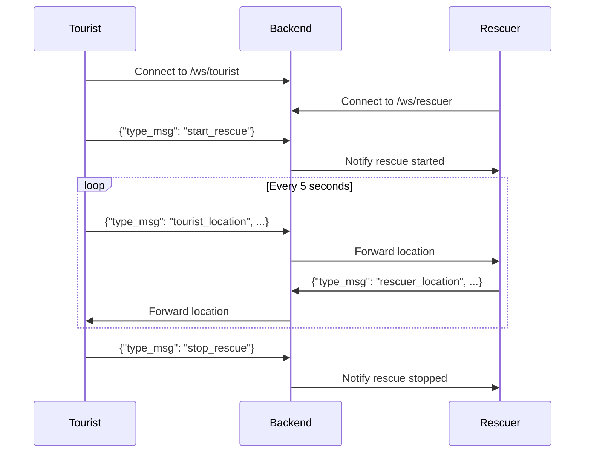

# Res-Q Backend - Kompletna Dokumentacja

## Spis Treści
1. [Przegląd](#przegląd)
2. [Architektura](#architektura)
3. [Technologie](#technologie)
4. [Struktura Projektu](#struktura-projektu)
5. [Instalacja i Konfiguracja](#instalacja-i-konfiguracja)
6. [API WebSocket](#api-websocket)
7. [Modele Danych](#modele-danych)
8. [Deployment](#deployment)
9. [Bezpieczeństwo](#bezpieczeństwo)

---

## Przegląd

Res-Q Backend to aplikacja serwerowa zbudowana w FastAPI, która zapewnia komunikację w czasie rzeczywistym poprzez WebSocket między turystami a ratownikami. System umożliwia śledzenie lokalizacji GPS i koordynację akcji ratunkowych.

### Główne Funkcjonalności
- **Komunikacja WebSocket w czasie rzeczywistym**
- **Śledzenie lokalizacji GPS** turystów i ratowników
- **System inicjowania i zatrzymywania akcji ratunkowych**
- **Architektura klient-serwer** z obsługą wielu jednoczesnych połączeń

---

## Architektura

### Ogólna Architektura

Backend Res-Q wykorzystuje architekturę opartą na FastAPI z następującymi komponentami:

```
┌─────────────┐         WebSocket          ┌──────────────┐
│   Tourist   │ ◄─────────────────────────► │              │
│   Client    │                             │              │
└─────────────┘                             │   FastAPI    │
                                            │   Backend    │
┌─────────────┐         WebSocket          │              │
│  Rescuer    │ ◄─────────────────────────► │              │
│   Client    │                             │              │
└─────────────┘                             └──────────────┘
```

### Wzorce Projektowe
- **Router Pattern** - separacja endpointów API
- **Dependency Injection** - wbudowane w FastAPI
- **Asynchronous Programming** - obsługa wielu jednoczesnych połączeń WebSocket

---

## Technologie

### Stack Technologiczny

| Technologia | Wersja | Zastosowanie |
|-------------|--------|--------------|
| **Python** | 3.12 | Język programowania |
| **FastAPI** | ~0.121.0 | Framework webowy |
| **Pydantic** | ~2.12.4 | Walidacja danych |
| **Starlette** | ~0.49.3 | ASGI framework (część FastAPI) |
| **Uvicorn** | latest | ASGI server |
| **WebSockets** | latest | Protokół komunikacji w czasie rzeczywistym |
| **Docker** | - | Konteneryzacja |

### Wymagania Systemowe
- Python 3.12 lub nowszy
- Docker (opcjonalnie)
- 512MB RAM minimum
- Port 8000 (domyślny)

---

## Struktura Projektu

```
backend/
├── app/
│   ├── main.py              # Główny plik aplikacji FastAPI
│   ├── api/                 # Moduł API
│   │   └── router.py        # Rejestracja routerów/endpointów
│   ├── core/                # Konfiguracja i funkcje podstawowe
│   └── tests/               # Testy jednostkowe i integracyjne
├── requirements.txt         # Zależności Python
├── Dockerfile              # Konfiguracja kontenera Docker
├── .gitignore             # Pliki ignorowane przez Git
└── README.md              # Podstawowa dokumentacja

```

### Opis Głównych Modułów

#### `app/main.py`
Główny punkt wejścia aplikacji. Inicjalizuje instancję FastAPI i rejestruje wszystkie routery.

```python
from fastapi import FastAPI
from .api.router import register_router

app = FastAPI()

# register endpoints
register_router(app)
```

#### `app/api/`
Zawiera logikę endpointów API, w tym obsługę WebSocket i routing.

#### `app/core/`
Moduł zawierający konfigurację aplikacji, middleware, oraz funkcje pomocnicze.

#### `app/tests/`
Katalog z testami jednostkowymi i integracyjnymi dla backendu.

---

## Instalacja i Konfiguracja

### Instalacja Lokalna

#### Krok 1: Klonowanie Repozytorium
```bash
git clone https://github.com/isigmas/Res-Q.git
cd Res-Q/backend
```

#### Krok 2: Tworzenie Środowiska Wirtualnego
```bash
python3.12 -m venv venv
source venv/bin/activate  # Linux/Mac
# lub
venv\Scripts\activate     # Windows
```

#### Krok 3: Instalacja Zależności
```bash
pip install -r requirements.txt
```

#### Krok 4: Uruchomienie Serwera
```bash
cd ..
uvicorn app.main:app --host 0.0.0.0 --port 8000 --reload
```

Aplikacja będzie dostępna pod adresem: `http://localhost:8000`

### Instalacja z Docker

#### Krok 1: Budowanie Obrazu Docker
```bash
cd backend
docker build -t resq-backend .
```

#### Krok 2: Uruchomienie Kontenera
```bash
docker run -d -p 8000:8000 --name resq-backend resq-backend
```

#### Konfiguracja Docker
Dockerfile wykorzystuje:
- **Obraz bazowy**: `python:3.12-slim`
- **Użytkownik niebędący root**: `appuser` (bezpieczeństwo)
- **Port**: 8000
- **Workdir**: `/app`
- **Environment**: `PYTHONUNBUFFERED=1` (natychmiastowe wyświetlanie logów)

---

## API WebSocket

### Endpoint WebSocket

#### Połączenie WebSocket
```
wss://resq-backend-isp4g.ondigitalocean.app/ws/{type}
```

**Parametry URL:**
- `{type}` - Typ użytkownika: `tourist` lub `rescuer`

**Przykład połączenia:**
```
wss://resq-backend-isp4g.ondigitalocean.app/ws/tourist
wss://resq-backend-isp4g.ondigitalocean.app/ws/rescuer
```

### Protokół Komunikacji

#### 1. Inicjalizacja Akcji Ratunkowej

**Opis:** Pierwszy komunikat wysyłany w celu rozpoczęcia lub zakończenia akcji ratunkowej.

**Format wiadomości:**
```json
{
  "type_msg": "start_rescue"
}
```

**Możliwe wartości `type_msg`:**
- `"start_rescue"` - rozpoczęcie akcji ratunkowej
- `"stop_rescue"` - zakończenie akcji ratunkowej

**Przykład użycia (JavaScript):**
```javascript
const ws = new WebSocket('wss://resq-backend-isp4g.ondigitalocean.app/ws/tourist');

ws.onopen = () => {
  // Rozpocznij akcję ratunkową
  ws.send(JSON.stringify({
    type_msg: "start_rescue"
  }));
};
```

#### 2. Aktualizacje Lokalizacji

**Opis:** Ciągłe wysyłanie informacji o lokalizacji GPS w pętli po zainicjowaniu akcji ratunkowej.

**Format wiadomości:**
```json
{
  "type_msg": "tourist_location",
  "latitude": 52.2297,
  "longitude": 21.0122,
  "altitude": 100.5,
  "accuracy": 10.0,
  "timestamp": 1699445910,
  "user_id": "user_123"
}
```

**Parametry:**

| Parametr | Typ | Wymagany | Opis |
|----------|-----|----------|------|
| `type_msg` | string | Tak | Typ wiadomości: `"tourist_location"` lub `"rescuer_location"` |
| `latitude` | float | Tak | Szerokość geograficzna (zakres: -90 do 90) |
| `longitude` | float | Tak | Długość geograficzna (zakres: -180 do 180) |
| `altitude` | float | Tak | Wysokość nad poziomem morza w metrach |
| `accuracy` | float | Tak | Dokładność pomiaru GPS w metrach |
| `timestamp` | int | Tak | Unix timestamp (sekund od 1970-01-01) |
| `user_id` | string | Nie | Identyfikator użytkownika (domyślnie: null) |

**Możliwe wartości `type_msg`:**
- `"tourist_location"` - lokalizacja turysty
- `"rescuer_location"` - lokalizacja ratownika

**Przykład użycia (JavaScript):**
```javascript
// Wysyłanie lokalizacji co 5 sekund
setInterval(() => {
  if (navigator.geolocation) {
    navigator.geolocation.getCurrentPosition((position) => {
      const locationData = {
        type_msg: "tourist_location",
        latitude: position.coords.latitude,
        longitude: position.coords.longitude,
        altitude: position.coords.altitude || 0,
        accuracy: position.coords.accuracy,
        timestamp: Math.floor(Date.now() / 1000),
        user_id: "user_123"
      };
      
      ws.send(JSON.stringify(locationData));
    });
  }
}, 5000);
```

**Przykład użycia (Python):**
```python
import websockets
import asyncio
import json
import time

async def send_location():
    uri = "wss://resq-backend-isp4g.ondigitalocean.app/ws/tourist"
    async with websockets.connect(uri) as websocket:
        # Rozpocznij akcję ratunkową
        await websocket.send(json.dumps({
            "type_msg": "start_rescue"
        }))
        
        # Wysyłaj lokalizację
        while True:
            location_data = {
                "type_msg": "tourist_location",
                "latitude": 52.2297,
                "longitude": 21.0122,
                "altitude": 100.5,
                "accuracy": 10.0,
                "timestamp": int(time.time()),
                "user_id": "user_123"
            }
            await websocket.send(json.dumps(location_data))
            await asyncio.sleep(5)

asyncio.run(send_location())
```

### Przepływ Komunikacji



---

## Modele Danych

### Model Inicjalizacji Akcji Ratunkowej

```python
from pydantic import BaseModel
from typing import Literal

class RescueAction(BaseModel):
    type_msg: Literal["start_rescue", "stop_rescue"]
```

**Przykład:**
```json
{
  "type_msg": "start_rescue"
}
```

### Model Lokalizacji GPS

```python
from pydantic import BaseModel, Field
from typing import Optional, Literal

class LocationUpdate(BaseModel):
    type_msg: Literal["tourist_location", "rescuer_location"]
    latitude: float = Field(..., ge=-90, le=90, description="Szerokość geograficzna")
    longitude: float = Field(..., ge=-180, le=180, description="Długość geograficzna")
    altitude: float = Field(..., description="Wysokość nad poziomem morza w metrach")
    accuracy: float = Field(..., gt=0, description="Dokładność GPS w metrach")
    timestamp: int = Field(..., gt=0, description="Unix timestamp")
    user_id: Optional[str] = Field(None, description="ID użytkownika")
```

**Przykład:**
```json
{
  "type_msg": "tourist_location",
  "latitude": 52.2297,
  "longitude": 21.0122,
  "altitude": 100.5,
  "accuracy": 10.0,
  "timestamp": 1699445910,
  "user_id": "user_123"
}
```

### Walidacja Danych

Pydantic automatycznie waliduje:
- ✅ Typy danych (float, int, string)
- ✅ Zakresy wartości (latitude: -90 do 90, longitude: -180 do 180)
- ✅ Wymagane pola
- ✅ Enum values dla `type_msg`

---

## Deployment

### Deployment na DigitalOcean

Aplikacja jest obecnie wdrożona na DigitalOcean App Platform:

**URL produkcyjny:**
```
wss://resq-backend-isp4g.ondigitalocean.app
```

#### Konfiguracja DigitalOcean App Platform

1. **Runtime:** Docker
2. **Port:** 8000
3. **Health Check:** HTTP GET na `/`
4. **Instance Size:** Basic (512MB RAM)
5. **Auto-scaling:** Włączony

#### Zmienne Środowiskowe (Production)

```bash
PYTHONUNBUFFERED=1
PORT=8000
```

### Deployment na Innych Platformach

#### Heroku

```bash
# Procfile
web: uvicorn app.main:app --host 0.0.0.0 --port $PORT
```

#### AWS ECS

```bash
docker build -t resq-backend .
docker tag resq-backend:latest <aws-account-id>.dkr.ecr.<region>.amazonaws.com/resq-backend:latest
docker push <aws-account-id>.dkr.ecr.<region>.amazonaws.com/resq-backend:latest
```

#### Google Cloud Run

```bash
gcloud builds submit --tag gcr.io/<project-id>/resq-backend
gcloud run deploy resq-backend --image gcr.io/<project-id>/resq-backend --platform managed
```

---

## Bezpieczeństwo

### Implementowane Środki Bezpieczeństwa

#### 1. Docker Security
- ✅ **Non-root user:** Aplikacja działa jako użytkownik `appuser` (nie root)
- ✅ **Slim image:** Użycie obrazu `python:3.12-slim` minimalizuje powierzchnię ataku
- ✅ **User permissions:** Właściwe uprawnienia do plików aplikacji

```dockerfile
RUN groupadd -r appgroup && useradd -r -s /bin/false -g appgroup appuser
RUN chown -R appuser:appgroup /app
USER appuser
```

#### 2. WebSocket Security
- ✅ **WSS Protocol:** Szyfrowane połączenie WebSocket (TLS/SSL)
- ✅ **Input Validation:** Pydantic waliduje wszystkie przychodzące dane
- ✅ **Type Safety:** Ścisłe typowanie zapobiega atakom typu injection

#### 3. Network Security
- ✅ **CORS:** Konfigurowalny w FastAPI
- ✅ **Rate Limiting:** Możliwość dodania middleware
- ✅ **Firewall:** Na poziomie infrastruktury (DigitalOcean)

### Rekomendowane Dodatkowe Środki

#### Authentication & Authorization
```python
# Przykład implementacji JWT authentication
from fastapi import Depends, HTTPException, status
from fastapi.security import HTTPBearer
import jwt

security = HTTPBearer()

async def verify_token(credentials = Depends(security)):
    try:
        payload = jwt.decode(credentials.credentials, SECRET_KEY, algorithms=["HS256"])
        return payload
    except jwt.InvalidTokenError:
        raise HTTPException(
            status_code=status.HTTP_401_UNAUTHORIZED,
            detail="Invalid token"
        )
```

#### Rate Limiting
```python
from slowapi import Limiter
from slowapi.util import get_remote_address

limiter = Limiter(key_func=get_remote_address)

@limiter.limit("5/minute")
async def websocket_endpoint():
    pass
```

#### Input Sanitization
```python
from pydantic import validator

class LocationUpdate(BaseModel):
    user_id: Optional[str]
    
    @validator('user_id')
    def sanitize_user_id(cls, v):
        if v:
            return v.strip()[:50]  # Limit length
        return v
```

---

## Monitoring i Logging

### Logging

FastAPI automatycznie loguje:
- Połączenia WebSocket
- Błędy serwera
- Request/Response

**Konfiguracja logowania:**
```python
import logging

logging.basicConfig(
    level=logging.INFO,
    format='%(asctime)s - %(name)s - %(levelname)s - %(message)s'
)

logger = logging.getLogger(__name__)
```

### Health Check Endpoint

```python
@app.get("/health")
async def health_check():
    return {
        "status": "healthy",
        "timestamp": int(time.time())
    }
```

### Metrics

Możliwe do zaimplementowania z Prometheus:
```python
from prometheus_fastapi_instrumentator import Instrumentator

Instrumentator().instrument(app).expose(app)
```

---

## Testowanie

### Struktura Testów

```
backend/app/tests/
├── __init__.py
├── test_websocket.py
├── test_models.py
└── test_api.py
```

### Przykład Testu WebSocket

```python
from fastapi.testclient import TestClient
from app.main import app

client = TestClient(app)

def test_websocket():
    with client.websocket_connect("/ws/tourist") as websocket:
        # Test start rescue
        websocket.send_json({"type_msg": "start_rescue"})
        
        # Test location update
        websocket.send_json({
            "type_msg": "tourist_location",
            "latitude": 52.2297,
            "longitude": 21.0122,
            "altitude": 100.5,
            "accuracy": 10.0,
            "timestamp": 1699445910,
            "user_id": "test_user"
        })
        
        data = websocket.receive_json()
        assert data is not None
```

### Uruchomienie Testów

```bash
# Instalacja pytest
pip install pytest pytest-asyncio

# Uruchomienie testów
pytest app/tests/ -v

# Z coverage
pytest app/tests/ --cov=app --cov-report=html
```

---

## Troubleshooting

### Częste Problemy

#### Problem: WebSocket nie może się połączyć
**Rozwiązanie:**
- Sprawdź czy serwer działa: `curl http://localhost:8000/health`
- Sprawdź firewall i porty
- Użyj `wss://` dla połączeń szyfrowanych, `ws://` dla lokalnych

#### Problem: "Module not found" podczas uruchomienia
**Rozwiązanie:**
```bash
# Upewnij się że jesteś w właściwym katalogu
cd /path/to/Res-Q
# Uruchom z app jako moduł
python -m uvicorn app.main:app --reload
```

#### Problem: Port 8000 jest już zajęty
**Rozwiązanie:**
```bash
# Użyj innego portu
uvicorn app.main:app --port 8001

# Lub zabij proces na porcie 8000
lsof -ti:8000 | xargs kill -9
```

---

## Performance

### Optymalizacja Wydajności

#### 1. Uvicorn Workers
```bash
uvicorn app.main:app --workers 4 --host 0.0.0.0 --port 8000
```

#### 2. WebSocket Connection Pooling
- Backend może obsługiwać tysiące jednoczesnych połączeń WebSocket
- Starlette wykorzystuje asyncio dla efektywnego zarządzania połączeniami

#### 3. Memory Management
- Slim Docker image: ~150MB
- Runtime memory: ~100-200MB per worker
- WebSocket overhead: ~1KB per connection

---

## Roadmap

### Planowane Funkcjonalności

- [ ] Autentykacja użytkowników (JWT)
- [ ] Baza danych (PostgreSQL/MongoDB)
- [ ] Persystencja historii akcji ratunkowych
- [ ] REST API dla danych historycznych
- [ ] Admin panel
- [ ] Rate limiting
- [ ] Prometheus metrics
- [ ] CI/CD pipeline
- [ ] E2E tests

---

## Kontakt i Wsparcie

### Repozytorium GitHub
- **URL:** https://github.com/isigmas/Res-Q
- **Issues:** https://github.com/isigmas/Res-Q/issues

### Licencja
Sprawdź plik `LICENSE` w repozytorium projektu.

---

## Changelog

### Wersja Aktualna (2025-11-08)
- ✅ WebSocket endpoints dla tourist i rescuer
- ✅ System inicjowania akcji ratunkowych
- ✅ Real-time location tracking
- ✅ Docker deployment
- ✅ DigitalOcean production deployment

---

**Data ostatniej aktualizacji:** 2025-11-08  
**Autor dokumentacji:** Generated for isigmas/Res-Q  
**Wersja:** 1.0.0